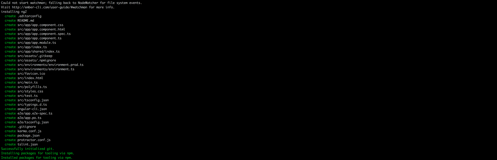
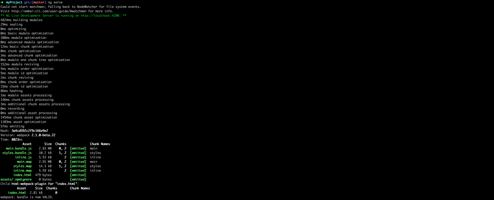
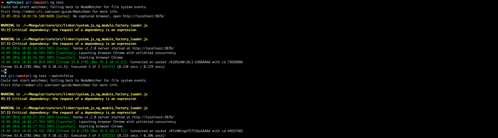
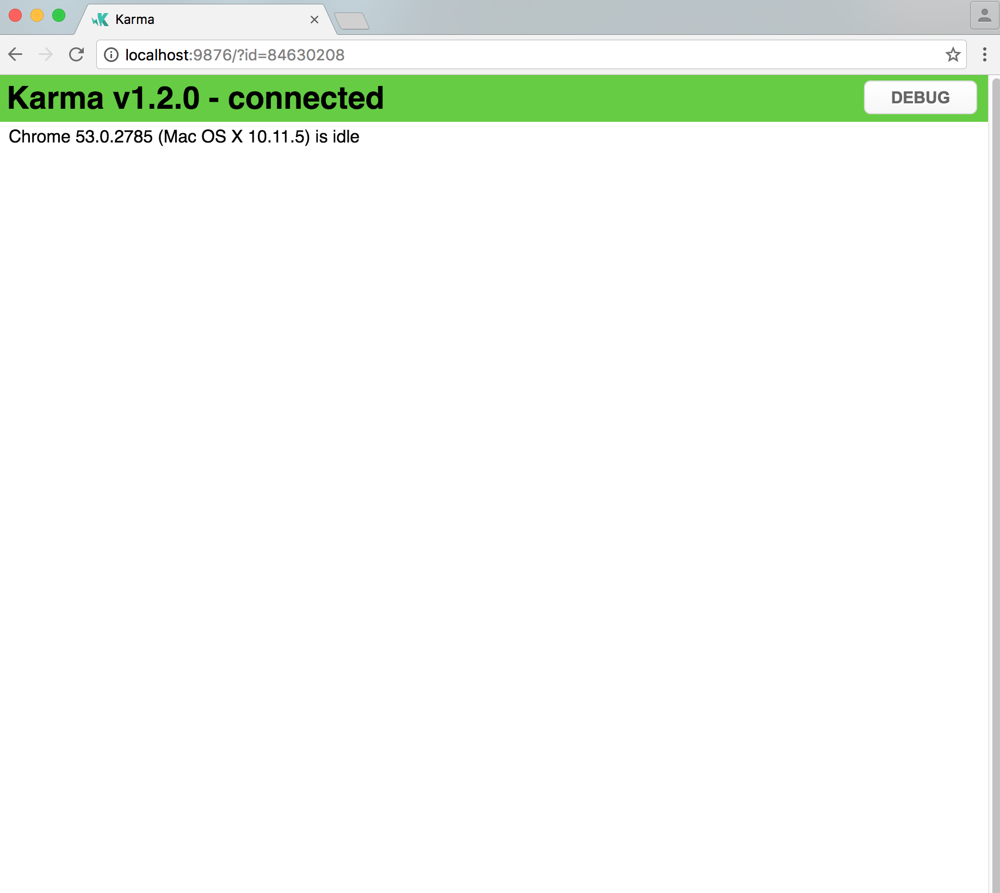
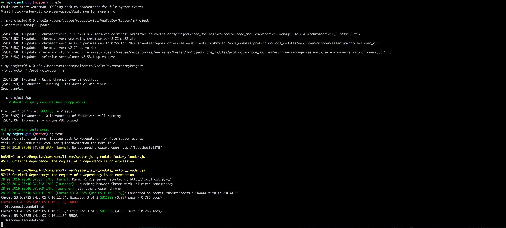

# Exercise: Setting up an angular 2 project with angular-cli

The goal of this exercise it to create a basic angular 2 app, using the angular-cli tool, and adding some libraries.

## Creation of a new project

First, create your new project by executing
```
$ ng new yourProject --style=sass
```
 or you can set the sass option later by setting:
 ```
 $ ng set defaults.styleExt scss
 ```





This will create a new folder with the name {yourProject}.

Enter the folder and try running the application:
```
$ cd yourProject
$ ng serve
```

You'll see that your application is getting build, and a dev server gets started.



You can visit the app on `http://localhost:4200`
Just to test, you can run:

```
$ ng test
$ ng e2e
```







Everything is working out of the box.


## Adding libraries through npm

We are now going to add some material design (npm packages) components. Although there is another way of adding the packages
'https://github.com/angular/material2/blob/master/GETTING_STARTED.md', we are going to use 'https://www.npmjs.com/~angular2-material#packages'.
Before we can start, we need to add another dependency. It's hammertime.

```
$ npm install --save-dev @types/hammerjs
```

Then, install the core package and all the component packages you want to use.

```
$ npm install --save @angular2-material/core
$ npm install --save @angular2-material/button
$ npm install --save @angular2-material/icon
$ npm install --save @angular2-material/card
$ npm install --save @angular2-material/input
$ npm install --save @angular2-material/toolbar
```
 For this example replace your current main component html with:

```html
<md-toolbar color="primary">
  {{title}}
</md-toolbar>
<div style="padding: 7px">
  <button md-button>Basic Button</button>
  <button md-raised-button>Raised Button</button>
</div>
<md-card>Awesome card..............</md-card>
```

If your dev server is running, you'll notice that webpack is rebuilding the app. You'll also notice that refreshing the app is failing. Why ?

We installed some packages. We used soms tags from it in our code. But we did not import the packages. To do so, open your main module and import the modules that we are going to use. (app.module.ts)

```
import { BrowserModule } from '@angular/platform-browser';
import { NgModule } from '@angular/core';
import { FormsModule } from '@angular/forms';
import { HttpModule } from '@angular/http';

import { MdButtonModule } from '@angular2-material/button';
import { MdCardModule } from '@angular2-material/card';
import { MdInputModule } from '@angular2-material/input';
import { MdCoreModule } from '@angular2-material/core';
import { MdToolbarModule } from '@angular2-material/toolbar';

import { AppComponent } from './app.component';

@NgModule({
  declarations: [
    AppComponent
  ],
  imports: [
    BrowserModule,
    FormsModule,
    HttpModule,

    MdButtonModule,
    MdCoreModule,
    MdCardModule,
    MdInputModule,
    MdToolbarModule

  ],
  providers: [],
  bootstrap: [AppComponent]
})
export class AppModule { }
```
