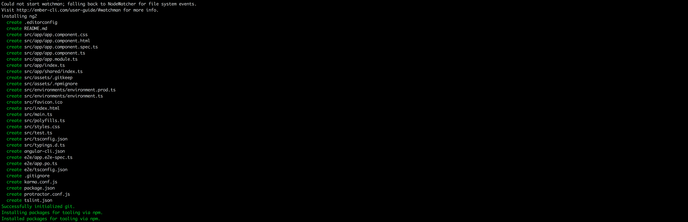

# Exercise: Create components to start building our app.

The goal of this exercise it to:
* Create components with angular-cli
* Import those components.
* Add them in your html.
* Create unit tests.


## Create the main view.

The app.component.ts (and html) is the main component for your app. It's auto generated when you create an app using `ng new {{myAwesomeApp}}``.


```
$ ng new yourProject --style=sass
```

 ```
 $ ng set defaults.styleExt scss
 ```



