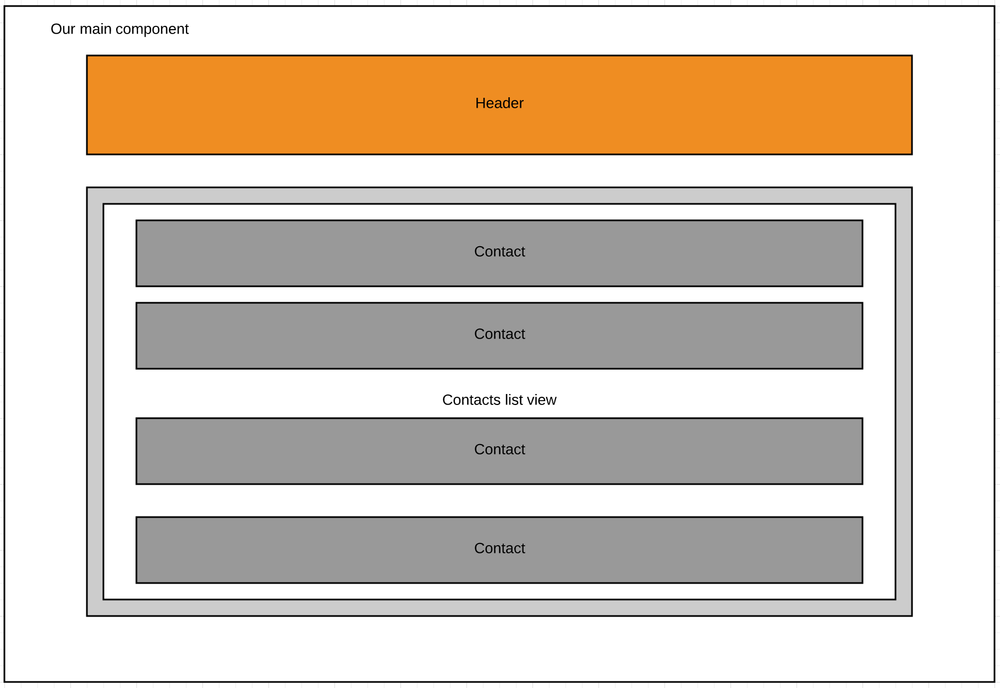

# Exercise: Create components to start building our app.

The goal of this exercise it to:
* Create components with angular-cli
* Import those components.
* Add them in your html and javascript.
* Combine the components.
* Create unit tests.




## Steps:

### step1:
Create a component ('header') and add it to the DOM of our main component. Make sure it stays hidden until our app is virtually loaded. The header should exist of a simple md-toolbar and it should display 'Jworks Contacts App'.

app.component.html
```html
<md-progress-circle *ngIf="loading" class="preloader" mode="indeterminate" color="primary"></md-progress-circle>
<app-header *ngIf="!loading">{{ title }}</app-header>
<md-card *ngIf="!loading" class="main">
    <md-card-content>
        <md-list>
            <md-list-item>
                <contact-card></contact-card>
            </md-list-item>
        </md-list>
    </md-card-content>
</md-card>
```

The second part of this step it to create a contact-card that will hold basic contact information. The contact can get displayed in the main md-card of our main component. Because we will need to refactor it later. I already added the `md-list` in the html.


NOTE: We already have model defintions and data available in /app/data and /app/models

Add contact you can use the first contact in our list and add it directly in your typescript.

```javascript
{
      id: 0,
      name: 'Wonne Keysers',
      email: 'wonne.keysers@ordina.be',
      phone: '32 476 22 63 30',
      birthday: '04-06-1980',
      website: 'https://www.ordina.be',
      image: '/assets/images/placeholder.png',
      address: {
        street: 'Blarenberg 3b',
        zip: '2800',
        city: 'Mechelen',
        country: 'Belgium'
      }
}
```

### step2:
Create a component ('contacts-list') and add it to the DOM of our main component.
Refactor parts of step1 so that the list is removed from our main component html and is added in the html of the new list component.
Because we need data for our list of contacts, we also need to refactor the list itself. Use `nfFor`to loop through all the contacts, and pass a particular contact to the contact-card as an input.

The data is available in `data/cc-contacts`. Just import it and pass it to the template.


