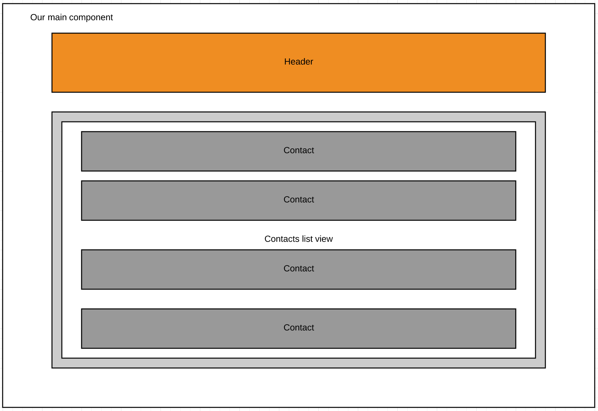
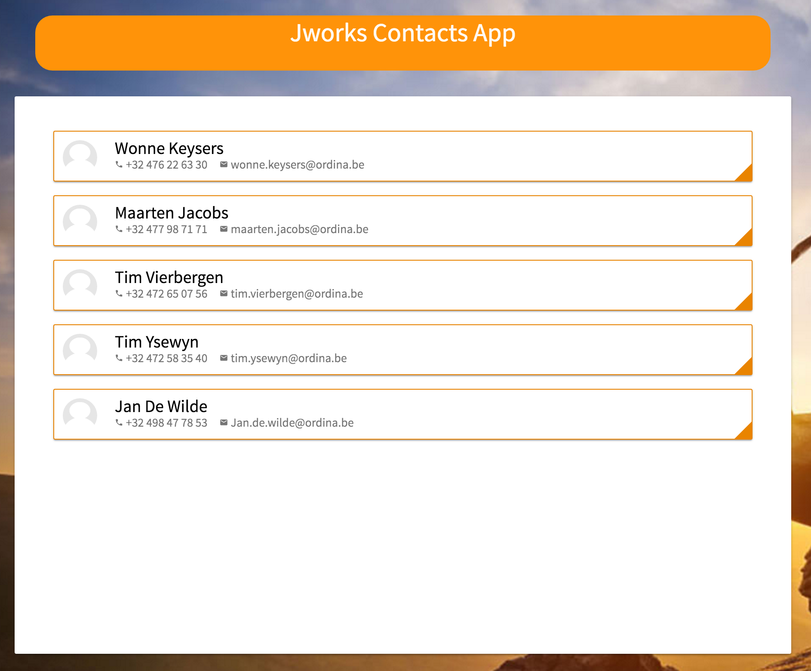

# Exercise: Create components to start building our app.

The goal of this exercise it to:
* Create components with angular-cli
* Import those components.
* Add them in your html and javascript.
* Combine the components.
* Create unit tests.




## Steps:

We start at the initial setup tag of our jworks cc contacts app.
```
git checkout step0-initialApp
```
### step1 solution:

#### Our header

First we will create the header.

```javascript
$ ng generate component header
```

In the header component:

```html
<md-toolbar class="header" color="primary" layout-align="center center">
  {{title}}
</md-toolbar>
```

```typescript
import { Component, OnInit } from '@angular/core';

@Component({
  selector: 'app-header',
  templateUrl: './header.component.html',
  styleUrls: ['./header.component.scss']
})
export class HeaderComponent implements OnInit {

  public title = 'Jworks Contacts App';

  constructor() { }

  ngOnInit() {
  }
}
```

```scss
md-toolbar{
    width: 90%;
    margin: 10px auto;
    color: white;
    font-family: 'Source Sans Pro', sans-serif;
    border-radius: 0;
    text-align: center;
    background-color: rgb(255, 147, 9) !important;
	display: block !important;

    @media screen and (min-width: 480px) {
        margin-top: 15px;
        font-size: 24px;
        width: 80%;
    }

    @media screen and (min-width: 680px) {
        margin-top: 30px;
        font-size: 30px;
        width: 75%;
    }
	&.md-primary {
		border-radius: 20px;
	}

    md-toolbar-row {
		display: block !important;
    }

}
```

Also added this css to the main styles.scss
```scss
md-toolbar md-toolbar-row {
      display: block !important;
}
```

See source code for the tests.

If you import it in our `NgModule`, you can use it in our main components html.


#### Our contact-card

```
$ ng generate component contact-card
```

```html
<md-card class="contact-card">
      
      <md-card-title>{{contact.name}}</md-card-title>
      <md-card-subtitle>
        <span><md-icon class="md-10">phone</md-icon>{{contact.phone}} </span>
        &nbsp;&nbsp;&nbsp;
        <span><md-icon class="md-10">email</md-icon>{{contact.email}} </span>
      </md-card-subtitle>
</md-card>
```

```typescript
import { Component, OnInit} from '@angular/core';
import { Contact } from '../models/cc-contact';

@Component({
  selector: 'contact-card',
  templateUrl: './contact-card.component.html',
  styleUrls: ['./contact-card.component.scss']
})
export class ContactCardComponent implements OnInit {

  contact: Contact = {
        id: 0,
        name: 'Wonne Keysers',
        email: 'wonne.keysers@ordina.be',
        phone: '32 476 22 63 30',
        birthday: '04-06-1980',
        website: 'https://www.ordina.be',
        image: '/assets/images/placeholder.png',
        address: {
          street: 'Blarenberg 3b',
          zip: '2800',
          city: 'Mechelen',
          country: 'Belgium'
        }
  };
  constructor() { }

  ngOnInit() {
  }

}
```

```scss
md-card.contact-card {
    position: relative;
    border: solid #e98300 1px;
    margin: 5px;
    padding: 10px;
    font-family: 'Source Sans Pro', sans-serif;
    height: 70%;
    &:after {
        position: absolute;
        right: 0;
        bottom: 0;
        content: "";
        width: 0;
        height: 0;
        border-style: solid;
        border-width: 0 0 20px 20px;
        border-color: transparent transparent #e98400 transparent;
    }
    &:hover {
        border-color: #333;
        &:after {
            border-color: transparent transparent #333 transparent;
        }
    }

    p {
      color: rgba(0,0,0,0.54);
      font-size: 12px;
      margin: Opx;
    }

    h3 {
        margin: 0px;
    }

    md-icon.md-10.material-icons{
      font-size: 10px;
      height: 12px;
      width: 12px;
      margin-right: 1px;
    }

    md-card-title {
        margin-bottom: 2px;
        font-size: 20px !important;  
    }

    .contact-card-avatar {
        float: left;
        margin-right: 20px;
    }
}
```
See source code for the tests.

#### Combine our components

Now we are going to add the two new components in our NgModule so we only need to import them once.

```javascript
...
import { HeaderComponent } from './header';
import { ContactCardComponent } from './contact-card';
...
@NgModule({
...
  declarations: [
    AppComponent,
    HeaderComponent,
    ContactCardComponent
  ],
...
```

```scss
@import "../_color-definitions";

md-list {
    padding-top: 0;

    &.split-view {
      @media screen and (min-width: 768px) {
        width: 40%;
      }
    }

    md-list-item {
        width: 100%;
        height: 75px;
        .md-list-item {
            height: 75px;
        }
    }

    contact-card {
        width: 100%;
    }
}
md-list md-list-item .md-list-item {
    height: 75px !important;
}
```

Add them in our app.component.html
```html
<md-progress-circle *ngIf="loading" class="preloader" mode="indeterminate" color="primary"></md-progress-circle>
<app-header *ngIf="!loading">{{ title }}</app-header>
<md-card *ngIf="!loading" class="main">
    <md-card-content>
        <md-list>
            <md-list-item>
                <contact-card></contact-card>
            </md-list-item>
        </md-list>
    </md-card-content>
</md-card>
```

See source code for the tests.


Solution available at
```
git checkout step1-components-part1-headerAndContact
```

### step2 solution:

In this step, we want to refactor the list with only a single contact to a new component with a list of contacts. Instead of putting the data directly in the javascript, we will import it from an external, packaged, source.

#### Create the list component.

```
ng generate component contacts-list
```

Again, this will create a folder in our root with an html-file, a typescript-file, a typescript test-file, a sass-file and an index file.

Remove the md-list from the main `app.component.html` and put it in the newly created component's html.

```html
<md-list>
  <md-list-item *ngFor="let contact of contacts">
    <contact-card [contact]=contact ></contact-card>
  </md-list-item>
</md-list>
```
As you can see, we will not just add an ngFor loop to it, but we will also pass the current contact to the contact-card component.
To be able to receive this contact as an input, we will need to import the `Input` and define it in our component. So remove the fixed contact in the contact-card and replace it with this input.

contact-card
```javascript
import { Component, OnInit, Input} from '@angular/core';
import { Contact } from '../models/cc-contact';

@Component({
  selector: 'contact-card',
  templateUrl: './contact-card.component.html',
  styleUrls: ['./contact-card.component.scss']
})
export class ContactCardComponent implements OnInit {

  @Input() contact: Contact;

  constructor() { }

  ngOnInit() {
  }
}
```

Add the contacts list in the list-component javascript.
```javascript
import { Component, OnInit } from '@angular/core';
import { Contact } from '../models/cc-contact';
import { CC_DATA } from '../data/cc-contacts';

@Component({
  selector: 'app-contacts-list',
  templateUrl: './contacts-list.component.html',
  styleUrls: ['./contacts-list.component.scss']
})
export class ContactsListComponent implements OnInit {

  contacts: Array<Contact> = CC_DATA;

  constructor() { }

  ngOnInit() {
  }
}
```

Move part of the scss from the main component to the list-component.
```scss
md-list {
    padding-top: 0;

    &.split-view {
      @media screen and (min-width: 768px) {
        width: 40%;
      }
    }

    md-list-item {
        width: 100%;
        height: 75px;
        .md-list-item {
            height: 75px;
        }
    }

    contact-card {
        width: 100%;
    }
}
```
And a last step, import the new component in our main module:
```javascript
...
import { ContactsListComponent } from './contacts-list';
...

    AppComponent,
    HeaderComponent,
    ContactCardComponent,
    ContactsListComponent
...
```

See source code for the tests.

Solution available at:
```
git checkout step2-components-contacts-list
```



