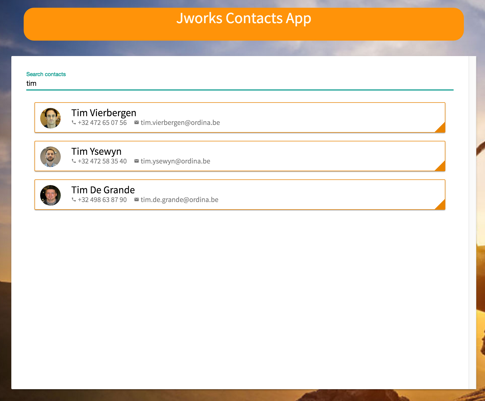

# Exercise: Implement a contacts service (with observables).

The goal of this exercise it to:
* Create a service.
* Refactor our app to use this service (remove contacts import).
* Refactor service to use http to call for the data.
* Refactor the app to use observables to get and  search for contacts
* Create unit tests for services and observables.


## Steps:

This part continues at the end of the components part. To start:
`$ git checkout step2-components-contacts-list`

### step1:

```
$ ng generate service jworks-contacts
```

This will create 2 files. A service.ts and a service.spec.ts file.
Import the static data into the service definition and add a function that returns this data.

```javascript
import { Injectable } from '@angular/core';
import { CC_DATA } from './data/cc-contacts';

@Injectable()
export class JworksContactsService {

  constructor() { }

  getContacts () {
    return CC_DATA;
  }
}
```

Import this newly created service into our main module and expose is as a provider.

```javascript
...
import { JworksContactsService } from './jworks-contacts.service';
...
  providers: [
    MdIconRegistry,
    JworksContactsService
  ],
...
```

Import the service in the contacts-list and replace the static data with the service.

```javascript
...
import { JworksContactsService } from '../jworks-contacts.service';
...
export class ContactsListComponent implements OnInit {

  contacts: Array<Contact>;

  constructor(private contactsService: JworksContactsService) { }

  ngOnInit() {
    this.contacts = this.contactsService.getContacts();
  }
}
...
```

Don't forget to inject the service through the constructor.
See source code for the tests.

Solution available at:
```
git checkout step2-components-contacts-list
```

### step2:
Import `HttpModule` and `Observable` in the main NgModule and expose the api_endpoint in the providers section.

```javascript
...
import { HttpModule } from '@angular/http';
import { Observable } from 'rxjs/Observable';
...
    providers: [
        MdIconRegistry,
        JworksContactsService,
        HttpModule,
        { provide: 'API_ENDPOINT', useValue: 'http://ec2-52-49-175-247.eu-west-1.compute.amazonaws.com:4201/api' }
    ],
...
```


Refactor the service to use the HttpModule and request the data. Don't forget to inject the end_point.

```javascript
import { Injectable, Inject } from '@angular/core';
import { Http } from '@angular/http';

@Injectable()
export class JworksContactsService {

  constructor(private http: Http, @Inject('API_ENDPOINT') private apiEndpoint) { }

  getContacts () {
    return this.http.get(`${this.apiEndpoint}/jworks-contacts`)
                    .map(res => res.json())
                    .map(data => data.items);
  }
}
```


Refactor the list component:

```javascript
import { Component, OnInit } from '@angular/core';
import { Contact } from '../models/cc-contact';
import { JworksContactsService } from '../jworks-contacts.service';
import { Observable } from 'rxjs/Observable';

@Component({
  selector: 'app-contacts-list',
  templateUrl: './contacts-list.component.html',
  styleUrls: ['./contacts-list.component.scss']
})
export class ContactsListComponent implements OnInit {

  contacts: Observable<Array<Contact>>;

  constructor(private contactsService: JworksContactsService) { }

  ngOnInit() {
    this.contacts = this.contactsService.getContacts();
  }
}
```

NOTE:
Added a fix for the images that are now served by the back-end.
Add a property to the contact-card that holds the baseUrl.
Changed the src property in the template so it concats the baseUrl with the imageUrl.

```
baseUrl = '';


```

### step3:
First we will add a search function to our service and our list-component

contacts-list.component
```javascript
search(term: string) {
    this.contacts = this.contactsService.search(term);
}
```

jworks-contacts.service
```javascript
search(term: string) {
    return this.http.get(`${this.apiEndpoint}/search?text=${term}`)
                    .map(res => res.json())
                    .map(data => data.items);
}
```


Then we will add an md-input to the list-component's html with a trigger on input.

```
<md-input (input)="search($event.target.value)" placeholder="Search contacts"></md-input>
```

```scss
md-input {
    width: calc(100% - 10px);
    margin: 5px;
    color: #e98300;
    .md-input-underline {
        border-top-color: #e98300 !important;
        .md-input-ripple.md-focused {
            background-color: #e98300 !important;
        }
    }    
    &.split-view {
        @media screen and (min-width: 768px) {
            width: 40%;
        }
    }
}
```

Because the search is getting triggered on echt input, we will now try to make this more efficient.

### step4:
First add some extra libs to our main Module.

```javascript
import 'rxjs/add/operator/map';
import 'rxjs/add/operator/filter';
import 'rxjs/add/operator/debounceTime';
import 'rxjs/add/operator/distinctUntilChanged';
import { Subject } from 'rxjs/Subject';
```

Then change the trigger in the html template:
```html
<md-input (input)="terms$.next($event.target.value)" placeholder="Search contacts"></md-input>
```

Then add the term to our component and add the search listener.

```javascript
...
private terms$ = new Subject<string>();
...
ngOnInit() {
    this.contacts = this.contactsService.getContacts();
    this.terms$.debounceTime(400)
               .distinctUntilChanged()
               .subscribe(term => this.search(term));
}
...
```


