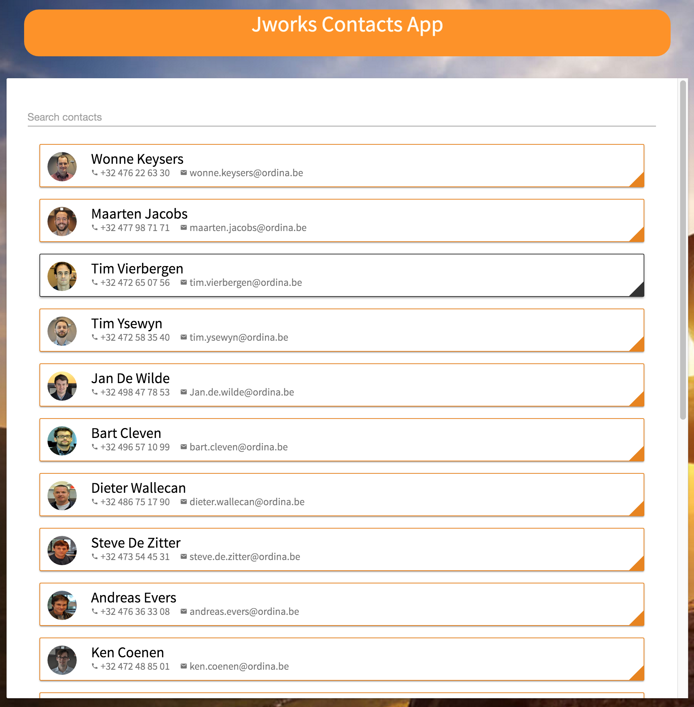
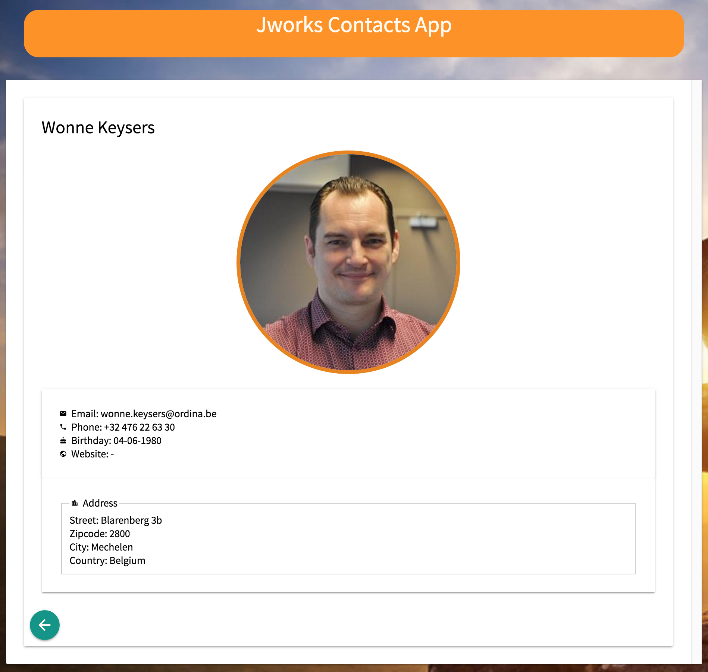

# Exercise: Implement a detail page and a router for navigation.

The goal of this exercise it to:
* Create a new component (contact-detail).
* Refactor the baseUrl for use in contact-card and contact-detail(image).
* Add a router and give the user a way to switch between the contacts list and a detail view.

## Steps:

This part continues at the end of the components tags. To start:
```
$ git checkout step6-services-efficientSearch
```

### step1:
First refactor the baseUrl in the contact-card.
* Remove the property from the contact-card file
* Add the provider

To do this, we first add the provider in the app.module.ts
```javascript
...
import { routing } from './app.routes';
...

...
providers: [
    MdIconRegistry,
    JworksContactsService,
    HttpModule,
    { provide: 'API_ENDPOINT', useValue: 'http://ec2-52-49-175-247.eu-west-1.compute.amazonaws.com:4201/api' },
    { provide: 'API_BASE', useValue: 'http://ec2-52-49-175-247.eu-west-1.compute.amazonaws.com:4201/'}
  ],
...
```

So instead of using a local property in the contact-card, we are going to use this kind of provider.
Inject this provider in the contact-card
```javascript
import { Component, OnInit, Input, Inject} from '@angular/core';
import { Contact } from '../models/cc-contact';

@Component({
  selector: 'contact-card',
  templateUrl: './contact-card.component.html',
  styleUrls: ['./contact-card.component.scss']
})
export class ContactCardComponent implements OnInit {

  @Input() contact: Contact;

  constructor(@Inject('API_BASE') private apiBase) { }

  ngOnInit() {
  }
}
```
So we import the `Inject` from angular/core and inject the API_BASE in our constructur so we can use it inside our view.
Because we want to be able to 'click' on the contact card (later) to navigate to our detail, we already implement a link in our contact-card as well.
Change the image (avatar) and replace it with an image, with a new url, and an anchor tag.
```html
...
 <a [routerLink]="['/contact', contact.id]">
    
  </a>
...  
```

Our contact-card can now link to a route (with a view) that doesn't exist yet.


### step2: Create a detail component.
For the next step, we create a new component. Generate it with angular-cli:
```
$ ng generate component contact-detail
```
If the index.ts file in the components' folder is not created by angular-cli, create it.
Make the index export the class in the typescript file.

Give the new view some content.
In the typescript file, add:
```javascript
import { Component, OnInit, Inject } from '@angular/core';
import { Router, ActivatedRoute } from '@angular/router';
import { Contact } from '../models/cc-contact';
import { JworksContactsService } from '../jworks-contacts.service';


@Component({
  selector: 'app-contact-detail',
  templateUrl: './contact-detail.component.html',
  styleUrls: ['./contact-detail.component.scss']
})
export class ContactDetailComponent implements OnInit {

  contact: Contact;

  constructor(private contactsService: JworksContactsService,private router: Router, private route: ActivatedRoute, @Inject('API_BASE') private apiBase) {}

  ngOnInit() {
    this.contactsService.getContact(this.route.snapshot.params['id'])
                        .subscribe(contact => this.contact = contact);
  }
}
```
Because we want to display a specific contact, we need to check the router params to find the `id` of the contact.
To do this, we've imported the `Router` from angular/router and injected it in our constructor.


In the html, add:
```html
<md-card md-theme="'default'" class="container">
  <md-card-title>
    <span class="md-headline">{{contact?.name}}</span>
    <span class="md-subhead"></span>
  </md-card-title>
  <md-card-content layout="row" layout-align="space-between">
    <div class="md-media-xl card-media md-content-inline">
      
    </div>
    <div class="md-content-inline">
        <md-card>
          <div class="row">
            <span class="col s6"><md-icon class="md-10">email</md-icon> Email:</span>
            <span class="col s6">{{contact?.email || '-'}}</span>
          </div>
          <div class="row">
            <span class="col s6"><md-icon class="md-10">phone</md-icon> Phone:</span>
            <span class="col s6">{{contact?.phone || '-'}}</span>
          </div>
          <div class="row">
            <span class="col s6"><md-icon class="md-10">cake</md-icon> Birthday:</span>
            <span class="col s6">{{contact?.birthday || '-'}}</span>
          </div>
          <div class="row">
            <span class="col s6"><md-icon class="md-10">public</md-icon> Website:</span>
            <span class="col s6">{{contact?.website || '-'}}</span>
          </div>
        </md-card>
        <md-card>
        <fieldset>
          <legend><md-icon class="md-10">location_city</md-icon> Address</legend>
          <div class="row">
            <span class="col s6">Street:</span>
            <span class="col s6">{{contact?.address?.street || '-'}}</span>
          </div>
          <div class="row">
            <span class="col s6">Zipcode:</span>
            <span class="col s6">{{contact?.address?.zip || '-'}}</span>
          </div>
          <div class="row">
            <span class="col s6">City:</span>
            <span class="col s6">{{contact?.address?.city || '-'}}</span>
          </div>
          <div class="row">
            <span class="col s6">Country:</span>
            <span class="col s6">{{contact?.address?.country || '-'}}</span>
          </div>
        </fieldset>
        </md-card>
    </div>

  </md-card-content>
  <md-card-actions layout="column">
       <button md-mini-fab class="md-primary js-back" routerLink="/" title="back">
       <md-icon class="md-36">arrow_back</md-icon>
      </button>
    </md-card-actions>
</md-card>

```
Notice the `contact?` syntax. This is needed because we are loading our contact through an observable. When the contact is not available yet, the '-' will be displayed.

### step3:
Create a router with 2 routes:
* / for the list-view
* /contact/{{id}} for the detail view.

The `[routerLink]="['/contact', contact.id]"` (onclick) will trigger a route. To make this work, we will need to define a route `contact/:d` in our router. Let's create our high level routes.

Create a new file in the root of our project `app.routes.ts` with content:
```javascript
import { Routes, RouterModule } from '@angular/router';
import { ContactsListComponent } from './contacts-list';
import { ContactDetailComponent } from './contact-detail';
import { ContactCardComponent } from './contact-card';

const routes: Routes = [
    {
      path: '',
      component: ContactsListComponent
    },
    {
      path: 'contact/:id',
      component: ContactDetailComponent
    },
    {
      path: '**',
      redirectTo: '',
      pathMatch: 'full'
    }
];

export const routing = RouterModule.forRoot(routes);
```

So we've defined 3 routes. A 'root', that will create our contactsListComponent and a contact specific route with a parameter `:id`. And a default route that will redirect to our list route.

Import our router in our main NgModule:
```javascript
...
import { routing } from './app.routes';
...

@NgModule({
  ...    
  imports: [
      ...
    routing,
    ...
  ]
  ...
```

We can now navigate between our contact-list and a contact-detail, by clicking on the avatar of the contact-card. A back button, routing back to the root of our app, will take us back to our contact-list.

NOTE:
Because we refactored to http instead of local contact resources, and we are now using injection to load some provider (e.g. 'API_BASE'), we need to change some tests as well. The source code for the tests is included in the repository.




