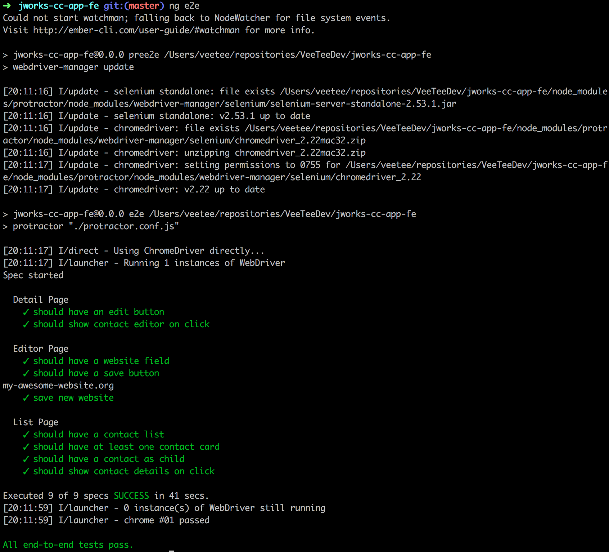

# Exercise: Implement some e2e tests.

E2E testing our app so far.
Depending on our unit tests, we need to test some flows...
For this exercise, we will try and navigate to an editor, change a field and save it.


## Steps:

This part continues at the end of the components tags. To start:
```
$ git checkout step8-editors
```

```
$ ng e2e
```

###step0:
Create a general page object to extend from.
```javascript
import Promise = webdriver.promise.Promise;

export abstract class PageObject {
  navigateTo(path?: string): Promise<void> {
    let p = path || '/';
    return browser.get(p);
  }
}
```


### step1:
Create a page object for the list component and write some tests in an e2e-spec file.
Try and navigate to a detail.

First create the page object for the list

```javascript
import Promise = webdriver.promise.Promise;
import ElementFinder = protractor.ElementFinder;
import {PageObject} from "./po";
export class ListPage extends PageObject{

  private contactsList;
  private firstContactCard;
  private contactCards;
  private firstLink;

  constructor() {
    super();
    this.contactsList = element(by.css('app-contacts-list'));
    this.contactCards = element(by.css('app-contact-card'));
    this.firstContactCard = element.all(by.css('app-contact-card')).get(0);
    this.firstLink =  element.all(by.css('app-contact-card')).get(0).all('a').get(0);
  }

  getContactsList():ElementFinder{
    return this.contactsList;
  }

  getFirstContact():ElementFinder{
    return this.firstContactCard;
  }

  getFirstContactAnchor(): ElementFinder {
    return this.getFirstContact().all(by.css('a')).get(0);
  }

  getContactCards():ElementFinder{
    return this.contactCards;
  }

}
```

Then write our real tests:
```javascript
import {ListPage} from './list.po';
import {DetailPage} from './detail.po';

describe('List Page', function () {
  let page: ListPage;

  beforeEach(() => {
    page = new ListPage();
    page.navigateTo();
  });

  it('should have a contact list', ()=> {
    page.getContactsList()
      .isPresent()
      .then((isPresent: boolean)=> {
        expect(isPresent).toBeTruthy();
      });
  });

  it('should have at least one contact card', ()=> {
    page.getContactCards()
      .isPresent()
      .then((isPresent: boolean)=> {
        expect(isPresent).toBeTruthy();
      });
  });

  it('should have a contact as child', ()=> {
    page.getFirstContact()
      .isPresent()
      .then((isPresent: boolean)=> {
        expect(isPresent).toBeTruthy();
      });
  });

  it('should show contact details on click', ()=> {
    let contactCardAvatar = page.getFirstContactAnchor().element(by.css('img'));
    contactCardAvatar.click().then(()=> {
        let detailPage = new DetailPage();
        detailPage.getContainer()
          .isPresent()
          .then((detailsPresent: boolean)=> {
            expect(detailsPresent).toBeTruthy();
          });
    });
  });
});
```


### step2:
Create a page object for the detail component and write some tests in an e2e-spec file.
Try and navigate to the editor.

```javascript
import Promise = webdriver.promise.Promise;
import ElementFinder = protractor.ElementFinder;
import {PageObject} from "./po";
export class DetailPage extends PageObject{

  private container;
  private name;
  private website;
  private editButton;

  constructor() {
    super();
    this.container = element(by.css('app-contact-detail'));
    this.name = element(by.css('md-card-title md-headline'));
    this.website = element(by.css('.js-website'));
    this.editButton = element.all(by.css('.js-edit')).get(0);

  }

  getContainer():ElementFinder {
      return this.container;
  }

  getEditButton():ElementFinder {
      return this.editButton;
  }

  getName():String{
    return this.name.getText();
  }

  clickOnEdit():Promise<void>{
    return this.editButton.click();
  }

  getWebsite():ElementFinder {
      return this.website;
  }
}
```

And some tests:
```javascript
import {ListPage} from './list.po';
import {DetailPage} from './detail.po';
import {EditorPage} from './editor.po';

describe('Detail Page', function () {
  let page: DetailPage;

  beforeEach(() => {
      page = new DetailPage();
      page.navigateTo('contact/0');      
  });

  it('should have an edit button', () => {
      page.getEditButton()
      .isPresent()
      .then((isPresent: boolean)=> {
        expect(isPresent).toBeTruthy();
      });
  });

  it('should show contact editor on click', ()=> {
        let editButton = page.getEditButton();
        editButton.click().then(()=> {
            let editorPage = new EditorPage();
            editorPage.getContainer()
            .isPresent()
            .then((detailsPresent: boolean)=> {
                expect(detailsPresent).toBeTruthy();
            });
        });
  });
});

```

### step3:
Create a page object for the edit component and write some tests in an e2e-spec file.
Try and save a new website value.

```javascript
import Promise = webdriver.promise.Promise;
import ElementFinder = protractor.ElementFinder;
import {PageObject} from "./po";
export class EditorPage extends PageObject{

  private container;
  private website;
  private saveButton;

  constructor() {
    super();
    this.container = element(by.css('app-contact-editor'));
    this.website = element(by.css('.js-website input'));
    this.saveButton = element(by.css('.js-save'));
  }

  getContainer():ElementFinder {
      return this.container;
  }

  getWebsite():ElementFinder{
    return this.website;
  }

  getWebsiteText():String{
    return this.website.getText();
  }

  getSaveButton():ElementFinder {
      return this.saveButton;
  }

  clickOnSave():Promise<void>{
    return this.saveButton.click();
  }
}
```

And some tests.

```javascript
import {DetailPage} from './detail.po';
import {EditorPage} from './editor.po';

describe('Editor Page', function () {
  let page: EditorPage;
  let pageName:string = 'my-awesome-website.org';

  beforeEach(() => {
      page = new EditorPage();
      page.navigateTo('contact/0/edit');      
  });

  it('should have a website field', () => {
      page.getWebsite()
      .isPresent()
      .then((isPresent: boolean)=> {
        expect(isPresent).toBeTruthy();
      });
  });

  it('should have a save button', () => {
      page.getSaveButton()
      .isPresent()
      .then((isPresent: boolean)=> {
        expect(isPresent).toBeTruthy();
      });
  });

  it('save new website', ()=> {
    let website = page.getWebsite();
    website.clear();     
    website.sendKeys(pageName);     

    page.clickOnSave().then(()=> {
      let detailPage = new DetailPage();
      detailPage.getWebsite().getText().then((val) => {
          console.log(val);
          expect(val).toEqual(pageName);
      });

    });
  });
});
```


And the result when running `ng e2e`:


